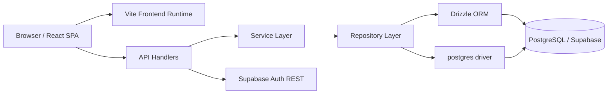
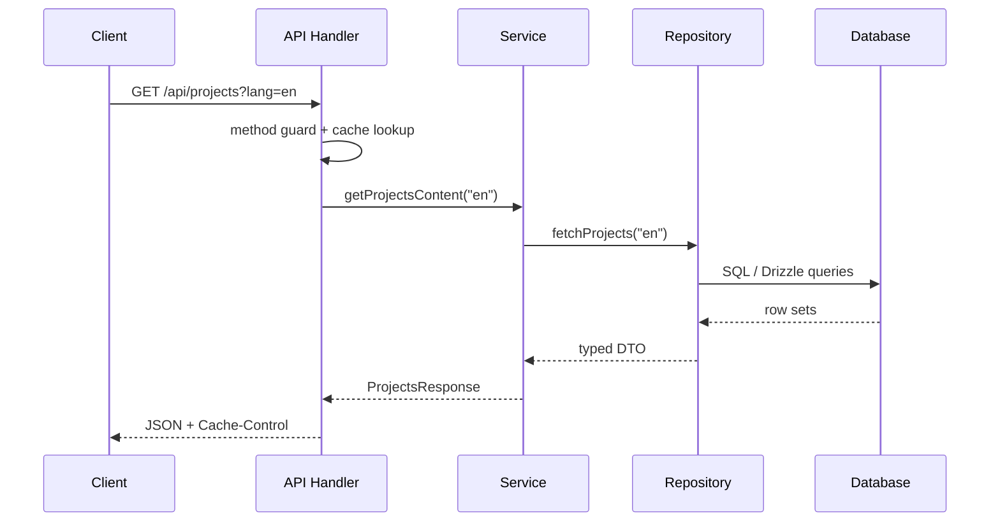
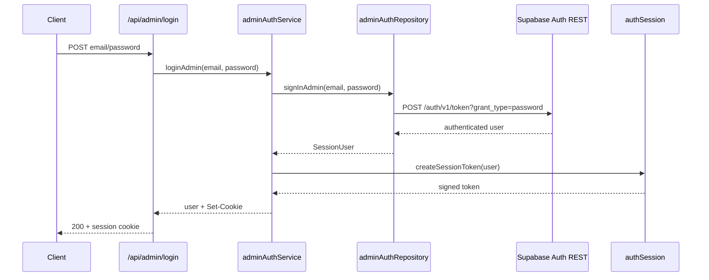
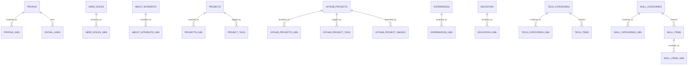

<p align="center">
  
</p>

<p align="center">
  <a href="https://vercel.com/">
    
  </a>
  <a href="https://github.com/Mik1810/Piccirilli_Michael_Portfolio">
    
  </a>
  <a href="./docs/API_CONTRACT.md">
    
  </a>
  <a href="./public/docs/Curriculum_Vitae_10_2025.pdf">
    
  </a>
</p>

<p align="center">
  
  
  
  
  
  
  
</p>

# Piccirilli Michael Portfolio

## 1. System definition

This repository implements a full-stack software system for publishing, querying, and administering a structured multilingual personal portfolio.

The word "portfolio" here should be interpreted in a technical sense:

- it is a presentation layer for professional and academic content;
- it is a content delivery system exposed through HTTP APIs;
- it is an admin-managed relational dataset with localization support;
- it is a deployable web application with deterministic build and typed contracts.

In operational terms, the system has two primary roles:

1. expose a public read-optimized interface for profile, skills, projects, experiences, and education;
2. expose a protected write-oriented admin surface for maintaining the underlying relational dataset.

## 2. Why this project exists

The repository solves a concrete information management problem:

- personal/professional content changes over time;
- the same content must be rendered in multiple views and multiple languages;
- data should be stored canonically in a database, not hardcoded into UI components;
- administrative updates should be possible without introducing a browser-side database SDK.

Therefore, this project is better understood as a small content system specialized for one domain rather than as a static brochure website.

## 3. Current repository state

At the current state of the repository:

- frontend runtime is fully TypeScript/TSX;
- backend API runtime is fully TypeScript;
- the dominant backend architecture is `api -> service -> repository -> database`;
- public repositories use Drizzle ORM over PostgreSQL;
- admin authentication uses Supabase Auth over REST;
- admin CRUD uses validated, parameterized SQL via the `postgres` driver;
- no runtime dependency remains on `supabase-js`;
- `typecheck`, `lint`, and `build` all pass.

## 4. High-level architecture

### 4.1 Component view



### 4.2 Backend request pipeline



### 4.3 Admin authentication pipeline



## 5. Functional scope

### 5.1 Public content domains

The public surface exposes the following content classes:

- profile identity;
- hero roles;
- social links;
- about interests;
- portfolio projects;
- featured GitHub projects;
- GitHub project images;
- experiences;
- education;
- technology categories and technology items;
- skill categories and localized skill items.

### 5.2 Admin scope

The admin surface provides:

- login/logout/session inspection;
- table discovery for allowed tables;
- generic CRUD over a whitelisted subset of the relational model.

## 6. Repository structure

```txt
api/
  about.ts
  experiences.ts
  health.ts
  profile.ts
  projects.ts
  skills.ts
  admin/
    login.ts
    logout.ts
    session.ts
    table.ts
    tables.ts

lib/
  adminTables.ts
  authSession.ts
  devApiServer.ts
  logger.ts
  requireAdminSession.ts
  cache/
    memoryCache.ts
  db/
    client.ts
    schema.ts
    repositories/
      aboutRepository.ts
      adminAuthRepository.ts
      adminTableRepository.ts
      experiencesRepository.ts
      profileRepository.ts
      projectsRepository.ts
      skillsRepository.ts
  http/
    apiUtils.ts
    rateLimit.ts
  services/
    adminAuthService.ts
    adminTableService.ts
    publicContentService.ts
  types/
    admin.ts
    auth.ts
    http.ts

src/
  App.tsx
  main.tsx
  components/
  context/
  data/
  types/

docs/
  API_CONTRACT.md

dump/
  dump.sql
  dump_schema.sql
```

## 7. Data model

### 7.1 Modeling strategy

The relational model uses:

- base tables for stable entities;
- `*_i18n` tables for locale-dependent text;
- `order_index` for deterministic presentation order;
- `slug` where semantic identity is useful beyond numeric IDs;
- explicit uniqueness constraints to preserve ordering and parent-child consistency.

### 7.2 Entity families

- `profile` + `profile_i18n`
- `hero_roles` + `hero_roles_i18n`
- `about_interests` + `about_interests_i18n`
- `projects` + `projects_i18n` + `project_tags`
- `github_projects` + `github_projects_i18n` + `github_project_tags` + `github_project_images`
- `experiences` + `experiences_i18n`
- `education` + `education_i18n`
- `tech_categories` + `tech_categories_i18n` + `tech_items`
- `skill_categories` + `skill_categories_i18n` + `skill_items` + `skill_items_i18n`

### 7.3 ER snapshot



### 7.4 Example schema fragment

From [schema.ts](/c:/Users/micha/Desktop/Piccirilli_Michael_Portfolio/lib/db/schema.ts):

```ts
export const profile = pgTable(
  'profile',
  {
    id: smallint('id').primaryKey().default(1).notNull(),
    fullName: text('full_name').notNull(),
    photoUrl: text('photo_url'),
    email: text('email'),
    cvUrl: text('cv_url'),
    universityLogoUrl: text('university_logo_url'),
  },
  (table) => [check('profile_id_check', sql`${table.id} = 1`)]
)
```

This is a good example of the current modeling philosophy:

- domain invariants are encoded in schema, not only in application code;
- the "single profile row" assumption is explicit;
- nullable and non-nullable fields reflect actual persistence semantics.

## 8. Public API architecture

### 8.1 Handler responsibilities

Handlers are intentionally thin. For example, [api/projects.ts](/c:/Users/micha/Desktop/Piccirilli_Michael_Portfolio/api/projects.ts):

```ts
const handler: ApiHandler = async (req, res) => {
  if (!enforceMethod(req, res, 'GET')) return

  const lang = normalizeRepositoryLocale(req.query?.lang)
  const cacheKey = `projects:${lang}`
  const cached = cache.get(cacheKey)
  if (cached) {
    res.setHeader('Cache-Control', 's-maxage=60, stale-while-revalidate=300')
    return res.status(200).json(cached)
  }

  try {
    const payload = await getProjectsContent(lang)
    // ...
    return res.status(200).json(payload)
  } catch (error) {
    logApiError('projects', error, { lang, url: req.url })
    return respondWithError(res, error)
  }
}
```

This illustrates the intended separation:

- HTTP concerns stay in the handler;
- application orchestration stays in services;
- data aggregation stays in repositories.

### 8.2 Service example

The public service layer is intentionally thin:

```ts
export const getProjectsContent = async (
  locale: RepositoryLocale
): Promise<ProjectsResponse> => fetchProjects(locale)
```

This may look minimal, but it establishes a stable composition boundary. The cost is negligible; the benefit is that orchestration logic can grow without forcing changes to the handler contract.

### 8.3 Repository example

From [projectsRepository.ts](/c:/Users/micha/Desktop/Piccirilli_Michael_Portfolio/lib/db/repositories/projectsRepository.ts):

```ts
const [
  projectRows,
  projectI18nRows,
  projectTagRows,
  githubProjectRows,
  githubProjectI18nRows,
  githubProjectTagRows,
  githubProjectImageRows,
] = await Promise.all([
  db.select({ id: projects.id, slug: projects.slug, orderIndex: projects.orderIndex, liveUrl: projects.liveUrl })
    .from(projects)
    .orderBy(asc(projects.orderIndex)),
  db.select({ projectId: projectsI18n.projectId, title: projectsI18n.title, description: projectsI18n.description })
    .from(projectsI18n)
    .where(eq(projectsI18n.locale, locale)),
  // ...
])
```

The repository is responsible for reconstructing the API projection from normalized relational data. This is one of the main reasons a repository layer exists at all: the HTTP response is not isomorphic to any single table.

## 9. Admin architecture

### 9.1 Authentication

Admin authentication is implemented in [adminAuthRepository.ts](/c:/Users/micha/Desktop/Piccirilli_Michael_Portfolio/lib/db/repositories/adminAuthRepository.ts):

```ts
const response = await fetch(`${supabaseUrl}/auth/v1/token?grant_type=password`, {
  method: 'POST',
  headers: {
    'Content-Type': 'application/json',
    apikey: supabaseSecretKey,
    Authorization: `Bearer ${supabaseSecretKey}`,
  },
  body: JSON.stringify({ email, password }),
})
```

Why this approach instead of `supabase-js`?

- the frontend does not need a persistent Supabase client or browser session state;
- the server remains the sole authority for admin session issuance;
- the runtime surface is smaller and easier to reason about;
- auth is explicit HTTP I/O rather than SDK-driven state transitions.

Trade-off:

- less convenience than a first-party SDK;
- more explicit request/response handling;
- better alignment with a server-owned session model.

### 9.2 Generic admin CRUD

The admin CRUD repository uses validated SQL identifiers and parameterized values:

```ts
const ensureIdentifier = (value: string) => {
  if (!IDENTIFIER_PATTERN.test(value)) {
    throw new Error(`Invalid SQL identifier: ${value}`)
  }
  return value
}

const rows = await runQuery(
  sqlClient`
    update ${sqlClient(ensureIdentifier(table))}
    set ${buildSetClause(row)}
    where ${buildWhereClause(keys)}
    returning *
  `
)
```

This design was selected instead of binding the admin panel to one typed repository per table because the admin UI is intentionally generic.

Why not a fully typed CRUD layer per table?

- the allowed admin tables are heterogeneous;
- a generic admin console benefits from late binding on table and columns;
- per-table services would increase boilerplate significantly.

Why not expose raw SQL to the client?

- security;
- validation;
- controlled whitelist of mutable tables;
- ability to preserve HTTP-level invariants and rate limiting.

### 9.3 Security note on dynamic SQL

The relevant distinction is not simply "prepared vs non-prepared", but:

- whether untrusted values are concatenated directly into SQL text;
- whether identifiers are validated before inclusion;
- whether scalar values are still transmitted as protocol parameters.

Current status:

- table and column identifiers are validated against a strict identifier pattern;
- table names are also constrained by an explicit admin whitelist;
- scalar values are passed through the `postgres` tagged-template interface as parameters;
- the previous `unsafe` path has been removed from the admin CRUD implementation.

Therefore, the current admin path is not equivalent to naive raw string concatenation.

### 9.4 `prepare: false` does not imply SQL injection

In [client.ts](/c:/Users/micha/Desktop/Piccirilli_Michael_Portfolio/lib/db/client.ts), the `postgres` client is initialized with:

```ts
client = postgres(connectionString, {
  prepare: false,
})
```

This choice affects prepared statement reuse/caching at the driver/protocol level. It does **not** imply that interpolated values are injected as raw string concatenation.

Why keep `prepare: false`?

- it is compatible with pooler-oriented deployment topologies;
- it avoids coupling the runtime to assumptions about prepared statement support in pooled environments;
- it is a transport/runtime decision, not a waiver of parameter binding.

In other words:

- `prepare: false` has performance/compatibility implications;
- unsafe string concatenation has security implications;
- these two concerns are related to SQL execution, but they are not the same problem.

## 10. Technology choices and trade-offs

### 10.1 React + Vite instead of Next.js

Current choice:

- React SPA
- Vite dev/build pipeline

Rationale:

- the project is primarily API-driven and does not currently require SSR;
- build and local feedback loop are fast;
- operational complexity is lower than a framework with server rendering semantics.

Trade-off versus Next.js:

- fewer built-in SSR/ISR features;
- less opinionated routing and data loading;
- simpler runtime model and smaller framework surface.

### 10.2 Context providers instead of Redux/Zustand

Current choice:

- React Context for language, theme, auth, profile, and content.

Rationale:

- the state graph is relatively small and domain-partitioned;
- the project does not currently need advanced client-side event sourcing, time travel, or multi-slice middleware.

Trade-off:

- context can become coarse-grained in larger apps;
- current scale does not yet justify external state machinery.

### 10.3 Drizzle instead of Prisma

Current choice:

- Drizzle ORM + explicit schema.

Rationale:

- schema and SQL shape remain visible and close to relational reality;
- the database model was already well understood from the SQL dump;
- the project benefits from a SQL-first style rather than a generated client abstraction.

Trade-off versus Prisma:

- less generator-driven developer ergonomics;
- more direct control over schema and query structure;
- lower abstraction distance from SQL.

### 10.4 Drizzle for public repositories, direct SQL for generic admin CRUD

This mixed model is intentional.

Why Drizzle for public reads:

- public reads have stable shapes;
- typed projections map well to deterministic DTOs;
- query intent remains readable.

Why direct SQL for generic admin CRUD:

- admin CRUD is dynamic across many tables;
- a fully typed query builder becomes awkward for table/column names known only at runtime;
- the direct SQL layer can still be made safe through identifier validation and parameterized values.

### 10.5 Server-owned session cookies instead of client-owned Supabase auth state

Current choice:

- server validates credentials;
- server signs session token;
- browser stores opaque cookie.

Rationale:

- the admin surface is small and controlled;
- the client should not own auth orchestration logic;
- authorization remains easy to enforce at API boundary.

### 10.6 In-memory cache/rate limit instead of Redis

Current choice:

- process-local TTL cache;
- process-local rate limiting.

Rationale:

- low operational overhead;
- sufficient for current scale and baseline deployment behavior;
- simpler than introducing distributed infra prematurely.

Trade-off:

- not shared across instances;
- not deterministic under horizontal scaling;
- upgrade path exists if future traffic warrants Redis.

## 11. Local development and reproducibility

### 11.1 Environment variables

The repository expects [`.env.local`](/c:/Users/micha/Desktop/Piccirilli_Michael_Portfolio/.env.local) with:

```env
SUPABASE_URL=https://<project-ref>.supabase.co
SUPABASE_SECRET_KEY=<service-role-or-secret>
DATABASE_URL=postgresql://<user>:<password>@<host>:5432/postgres?sslmode=require
```

Semantics:

- `SUPABASE_URL`: HTTP endpoint used for admin auth REST
- `SUPABASE_SECRET_KEY`: secret used by admin auth flow
- `DATABASE_URL`: PostgreSQL DSN for Drizzle, `postgres`, and SQL tooling

### 11.2 Commands

Development:

```bash
npm run dev
npm run dev:api
npm run dev:fast
npm run dev:vercel
```

Quality gates:

```bash
npm run typecheck
npm run lint
npm run build
npm run format
```

Database tooling:

```bash
npm run db:generate
npm run db:migrate
npm run db:studio
```

### 11.3 Runtime notes

- frontend runs on `http://localhost:5173`
- local API runs on `http://localhost:3000`
- `dev:api` uses `tsx watch`, so backend edits typically hot-restart without manual intervention

## 12. Observability and operational safeguards

### 12.1 Error handling

Core files:

- `lib/http/apiUtils.ts`
- `lib/logger.ts`

Capabilities:

- method enforcement;
- typed HTTP errors;
- consistent JSON error shape;
- contextual logging with endpoint metadata.

### 12.2 Rate limiting

Current limits:

- `POST /api/admin/login`: `5` requests per minute per client
- `/api/admin/table`: `120` requests per minute per client

### 12.3 Cache behavior

Public content endpoints use:

```txt
Cache-Control: s-maxage=60, stale-while-revalidate=300
```

and a process-local memory cache for repeated reads.

## 13. Visual documentation choice

No binary screenshots are embedded in this README because they would document appearance rather than system behavior.

For this project, architecture diagrams are more informative than UI images. For that reason, Mermaid diagrams are used instead of static screenshots:

- they are diff-friendly;
- they can evolve with the code;
- they document behavior, not only surface appearance.

If UI documentation becomes important later, screenshots or annotated mockups can be added in a separate `docs/` section.

## 14. Current limitations

The current design is intentionally disciplined but not final.

Known limits:

- cache and rate limiting are not distributed;
- admin CRUD is generic and only partially type-driven;
- no formal runtime schema validation library such as Zod is currently integrated;
- no SSR layer exists;
- no project-detail route/page is currently documented as part of the public surface.

These are engineering trade-offs, not accidental omissions.

## 15. Internal references

- roadmap: [IMPROVEMENTS.md](/c:/Users/micha/Desktop/Piccirilli_Michael_Portfolio/IMPROVEMENTS.md)
- API contract: [API_CONTRACT.md](/c:/Users/micha/Desktop/Piccirilli_Michael_Portfolio/docs/API_CONTRACT.md)
- session log: [SESSION.md](/c:/Users/micha/Desktop/Piccirilli_Michael_Portfolio/SESSION.md)
- DB schema dump: [dump_schema.sql](/c:/Users/micha/Desktop/Piccirilli_Michael_Portfolio/dump/dump_schema.sql)
