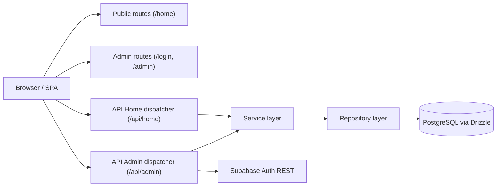
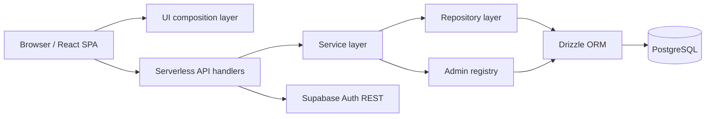
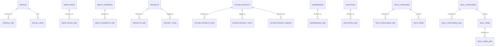

<p align="center">
  
</p>

<p align="center">
  <a href="https://michaelpiccirilli.vercel.app">
    
  </a>
  <a href="https://github.com/Mik1810/Piccirilli_Michael_Portfolio">
    
  </a>
  <a href="https://github.com/Mik1810/Piccirilli_Michael_Portfolio/actions/workflows/ci.yml">
    
  </a>
  <a href="./docs/API_CONTRACT.md">
    
  </a>
  <a href="./TODO.md">
    
  </a>
  
  
</p>

<p align="center">
  
  
  
  
  
  
  
  
</p>

# Piccirilli Michael Portfolio

**Artifact version:** `1.2.6`  
**Classification:** single-actor multilingual portfolio CMS  
**Canonical deployment target:** Vercel + Supabase PostgreSQL/Auth

## Quickstart

### Prerequisites

- Node.js `>= 20`
- npm `>= 10`
- Supabase project (Auth + Postgres)
- Resend API key (for `/api/contact`)

### Environment setup

Create `.env.local` in repo root (you can start from `.env.example`):

```bash
cp .env.example .env.local
```

Then fill the required values:

```bash
SUPABASE_URL=...
SUPABASE_SECRET_KEY=...
DATABASE_URL=...
RESEND_API_KEY=...
CONTACT_FROM_EMAIL=onboarding@resend.dev
CONTACT_TO_EMAIL=your@email.tld
```

Optional local debug flags:

```bash
DEV_API_WARMUP=true
DEV_API_DEBUG_LOGS=true
VITE_DEBUG_LOGS=true
```

### Install and run

```bash
npm ci
npm run dev:fast
```

Alternative local runs:

```bash
npm run dev
npm run dev:api
npm run dev:vercel
```

### Validation commands

```bash
npm run lint
npm run typecheck
npm run test:api
npm run build
```

## Status Snapshot

| Area | Status | Notes |
| --- | --- | --- |
| Backend hardening | Done | validation, env checks, rate limits, error handling |
| Public homepage loading stability | Done | TODO point 15 formally closed |
| Admin health/observability | Partial | DB latency chart done, chart policy/UX refinement still open |
| UI/component automated tests | Open | API/repository tests available, UI test layer pending |
| Distributed rate limiting | Partial | Redis-backed mode available (`RATE_LIMIT_MODE=redis`) with in-memory fallback |

## Operational Map (App/Admin/Tests/Deploy)

| Surface | Path / Command | Purpose |
| --- | --- | --- |
| Public app | `/home` | portfolio public UI |
| Admin login | `/login` | admin authentication entrypoint |
| Admin home | `/admin` | admin operational dashboard |
| Admin tables | `/admin/tables` | schema-driven CRUD console |
| API tests | `npm run test:api` | handlers + repository integration suites |
| Quality gates | `npm run lint && npm run typecheck && npm run build` | pre-push technical baseline |
| Deploy | Vercel + Supabase | serverless frontend/API + hosted Postgres/Auth |

## Architecture At A Glance



### End-to-end request example

`GET /api/projects?lang=it` -> `api/home.ts` dispatcher -> `public-routes/projects` handler -> `publicContentService` -> `projectsRepository` -> Drizzle query -> normalized JSON DTO -> React section unlock.

## Abstract

This repository implements a full-stack portfolio system whose main objective is not merely presentation, but controlled storage, publication, and administration of multilingual professional content. The system is modeled as a domain-specific content management artifact for a single actor: the public surface behaves like a highly curated portfolio site, while the backend and admin plane behave like a bounded CMS with explicit relational invariants.

The implementation adopts a two-plane architecture. The **public read plane** exposes deterministic, locale-aware JSON contracts consumed by a React/Vite single-page frontend. The **admin control plane** provides authenticated, schema-driven CRUD over selected relational tables, using metadata derived from a compile-time schema rather than ad hoc per-entity forms. Runtime persistence is handled through Drizzle ORM and PostgreSQL; authentication remains delegated to Supabase Auth over explicit HTTP calls, without shipping a browser database SDK into the admin runtime.

From a software-engineering standpoint, the repository should be read as an operationally deployable artifact with reproducible quality gates, typed boundaries, CI-backed verification, and a live roadmap of still-open work.

## Keywords

`portfolio CMS`, `single-page application`, `TypeScript`, `React`, `Vite`, `Drizzle ORM`, `PostgreSQL`, `Supabase Auth`, `Vercel Functions`, `schema-driven admin`, `multilingual relational content`

## 1. Research Context and Design Questions

The project addresses the following design problem:

- portfolio content changes over time and should not require code edits for routine maintenance;
- the same conceptual entities must be rendered in more than one locale;
- presentation order is semantically meaningful and must be stored explicitly;
- public consumers should observe stable JSON contracts rather than query the database directly;
- the admin surface should remain server-owned and should not depend on a browser-managed database client.

These requirements rule out a purely static site architecture. The resulting system needs:

1. a normalized relational model;
2. a typed API layer;
3. an authenticated administrative control plane;
4. frontend readiness boundaries capable of partial loading without invalid transient UI states.

## 2. Verified Contributions of the Current Artifact

At the current `main` state, the repository provides the following verified properties:

- full TypeScript coverage across frontend, backend handlers, repositories, and operational tooling;
- stable backend layering of the form `api -> service -> repository -> database`;
- Drizzle-backed public repositories for profile, about, projects, experiences, and skills;
- a schema-driven admin plane whose generic CRUD is bounded by compile-time metadata under [lib/admin](./lib/admin);
- Supabase used only as hosted PostgreSQL/Auth infrastructure, not as the runtime query abstraction;
- a server-side contact flow under `/api/contact`, backed by Resend, with request validation, rate limiting, honeypot filtering, and dedicated API tests;
- GitHub Actions CI that runs `npm ci --no-fund --no-audit`, `npm run lint`, `npm run typecheck`, `npm run test:api`, and `npm run build`, then publishes a Markdown summary and log artifact;
- Vercel-compatible serverless tuning, including explicit avoidance of the deprecated `req.query` runtime path under Node 24;
- public progressive rendering with coordinated skeleton states and staged section unlocks.

## 3. System Model

### 3.1 Macro-architecture



The browser only consumes HTTP contracts and generated admin metadata. Persistence and authentication remain server-owned concerns.

### 3.2 Repository cartography

| Area | Primary files | Role |
| --- | --- | --- |
| Public API | [api/home.ts](./api/home.ts) + [lib/services/public-routes/](./lib/services/public-routes) | public endpoint dispatch behind a single serverless entrypoint |
| Admin API | [api/admin.ts](./api/admin.ts) + [lib/services/admin-routes/](./lib/services/admin-routes) | authenticated admin endpoints behind a single serverless entrypoint |
| Service layer | [lib/services/](./lib/services) | orchestration between HTTP concerns and repositories |
| Database access | [lib/db/](./lib/db) | Drizzle client, schema, repositories |
| Admin registry | [lib/admin/](./lib/admin) | table metadata, validators, grouping, editor semantics |
| HTTP utilities | [lib/http/](./lib/http) | method guards, URL parsing, rate limiting, HTTP errors |
| Frontend UI | [src/components/](./src/components) | public and admin React components |
| CI / operations | [.github/workflows/](./.github/workflows) | verification and deployment cleanup workflows |

### 3.3 Routing model

The deployment routing strategy is intentionally simple. [vercel.json](./vercel.json) serves filesystem assets first and then falls back to `index.html`, allowing the public site to remain a single-page application while still exposing serverless API endpoints.

Both public and admin APIs are intentionally consolidated to stay within Vercel Hobby function-count limits while preserving route-level separation in code:
- public routes are dispatched by [api/home.ts](./api/home.ts), with modular handlers in [lib/services/public-routes/](./lib/services/public-routes);
- admin routes are dispatched by [api/admin.ts](./api/admin.ts), with modular handlers in [lib/services/admin-routes/](./lib/services/admin-routes).

## 4. Persistence Model and Invariants

### 4.1 Modeling strategy

The database follows a normalized multilingual pattern:

- base tables describe structural entities;
- `*_i18n` tables describe locale-specific text;
- `order_index` encodes deterministic rendering order;
- `slug` provides stable semantic identifiers where useful;
- child relations model tags, images, and auxiliary ordered content;
- uniqueness constraints encode invariants in schema rather than inferring them from UI behavior.

### 4.2 Entity families

- `profile` + `profile_i18n` + `social_links`
- `hero_roles` + `hero_roles_i18n`
- `about_interests` + `about_interests_i18n`
- `projects` + `projects_i18n` + `project_tags`
- `github_projects` + `github_projects_i18n` + `github_project_tags` + `github_project_images`
- `experiences` + `experiences_i18n`
- `education` + `education_i18n`
- `tech_categories` + `tech_categories_i18n` + `tech_items`
- `skill_categories` + `skill_categories_i18n` + `skill_items` + `skill_items_i18n`

### 4.3 ER snapshot



### 4.4 Example schema fragment

From [lib/db/schema.ts](./lib/db/schema.ts):

```ts
export const githubProjectImages = pgTable(
  'github_project_images',
  {
    id: bigint('id', { mode: 'number' }).primaryKey().generatedByDefaultAsIdentity(),
    githubProjectId: bigint('github_project_id', { mode: 'number' }).notNull(),
    orderIndex: integer('order_index').notNull(),
    imageUrl: text('image_url').notNull(),
    altText: text('alt_text'),
  },
  (table) => [
    unique('github_project_images_github_project_id_order_index_key').on(
      table.githubProjectId,
      table.orderIndex
    ),
  ]
)
```

This fragment is representative of the broader modeling philosophy:

- order is first-class;
- media is modeled as a relation, not as a UI-only convenience field;
- data integrity is encoded in schema wherever possible.

## 5. Public Read Plane

### 5.1 Endpoint surface

| Endpoint | Purpose |
| --- | --- |
| `/api/profile` | hero profile, portrait metadata, socials, hero roles |
| `/api/about` | about copy and interests |
| `/api/projects` | portfolio projects, GitHub projects, tags, gallery images |
| `/api/skills` | tech stack, skill categories, localized skill items |
| `/api/experiences` | professional experience and education |
| `/api/health` | operational sanity check |
| `/api/contact` | validated contact submission with rate limiting, honeypot filtering, and Resend-backed delivery |

### 5.2 Handler protocol

Each public endpoint is intentionally narrow:

1. enforce method constraints;
2. normalize locale from the WHATWG URL parser in [lib/http/apiUtils.ts](./lib/http/apiUtils.ts);
3. check the process-local memory cache in [lib/cache/memoryCache.ts](./lib/cache/memoryCache.ts);
4. invoke [lib/services/publicContentService.ts](./lib/services/publicContentService.ts);
5. serialize deterministic DTOs.

The handler is not responsible for reconstructing relational content. That responsibility is delegated to the repository layer.

### 5.3 Repository composition

The repositories reconstruct denormalized read models from normalized tables. For example, [lib/db/repositories/projectsRepository.ts](./lib/db/repositories/projectsRepository.ts) composes:

- base project rows;
- localized `*_i18n` rows;
- tag relations;
- featured GitHub projects;
- GitHub image galleries from `github_project_images`.

The legacy `github_projects.image_url` field has been removed from the runtime model; `github_project_images` is now the canonical media relation for the GitHub project gallery flow.

### 5.4 Progressive rendering semantics

The public UI was tuned toward **monotonic rendering**: each section transitions from placeholder to valid content without undefined intermediate states. Concretely, the current frontend provides:

- section-level skeletons rather than one global blocking spinner;
- synchronized hero portrait/text reveal in [src/components/jsx/HeroTyping.tsx](./src/components/jsx/HeroTyping.tsx);
- staged public bootstrap in [src/context/ContentContext.tsx](./src/context/ContentContext.tsx), so sections unlock progressively instead of waiting on one monolithic batch;
- a GitHub screenshot viewer with click-triggered lightbox and gallery prewarming.

## 6. Admin Control Plane

### 6.1 Authentication boundary

The admin uses Supabase Auth as authentication authority, but the browser never talks to Supabase directly. Instead:

1. credentials are posted to [api/admin.ts](./api/admin.ts) using the `/api/admin/login` route;
2. the server forwards them to Supabase Auth REST;
3. the server issues and verifies its own signed session cookie;
4. the React admin consumes only the server-owned session endpoints.

This design keeps the browser-side admin runtime smaller and preserves a clear server-owned trust boundary.

### 6.2 Schema-driven registry

The admin backend is mediated by metadata under [lib/admin](./lib/admin), especially [lib/admin/registry.ts](./lib/admin/registry.ts) and the domain table modules in [lib/admin/tables/](./lib/admin/tables). The registry encodes:

- allowed tables;
- labels and structural descriptions;
- table grouping and sidebar hierarchy;
- primary keys and default row shapes;
- field kinds (`text`, `textarea`, `number`, `url`, `email`, `checkbox`, `color`, `select`);
- relation selectors for foreign keys;
- normalization and validation rules.

The admin is therefore generic at the UX layer, but not schema-agnostic.

### 6.3 Drizzle-backed generic CRUD

Admin CRUD operations are executed through metadata-constrained Drizzle operations:

- registry lookup;
- payload normalization;
- validation via [lib/services/adminTableService.ts](./lib/services/adminTableService.ts);
- resolved `select / insert / update / delete` in [lib/db/repositories/adminTableRepository.ts](./lib/db/repositories/adminTableRepository.ts).

This provides a meaningful midpoint between a hardcoded backoffice and unconstrained dynamic SQL.

### 6.4 Admin UI synthesis

The frontend dashboard in [src/components/jsx/AdminTable.tsx](./src/components/jsx/AdminTable.tsx) synthesizes its UI from registry metadata:

- grouped and nested sidebar navigation;
- typed editors and relation-backed selects;
- bilingual create flows for `*_i18n` tables;
- structural descriptions for low-semantic tables such as `hero_roles` and `skill_items`;
- compact previews for links, images, icons, colors, and documents.

Operationally, the admin subtree is lazy-loaded as a dedicated asset family (`assets/admin-*`) through [vite.config.js](./vite.config.js), keeping the public bundle smaller.

## 7. Runtime, Deployment, and Reproducibility

### 7.1 Required environment variables

The runtime expects a local `.env.local` containing at least:

| Variable | Role |
| --- | --- |
| `SUPABASE_URL` | Supabase HTTP base URL used for auth REST calls |
| `SUPABASE_SECRET_KEY` | secret/service credential used for admin auth requests |
| `DATABASE_URL` | PostgreSQL DSN used by Drizzle, postgres, and DB tooling |
| `RATE_LIMIT_MODE` | rate limiter backend selector: `memory` (default) or `redis` |
| `UPSTASH_REDIS_REST_URL` | Upstash Redis REST endpoint (required only when `RATE_LIMIT_MODE=redis`) |
| `UPSTASH_REDIS_REST_TOKEN` | Upstash Redis REST token (required only when `RATE_LIMIT_MODE=redis`) |
| `RESEND_API_KEY` | Resend API key used by the contact endpoint |
| `CONTACT_FROM_EMAIL` | sender address for contact submissions (`onboarding@resend.dev` for test mode) |
| `CONTACT_TO_EMAIL` | destination inbox for contact submissions |

For Vercel production, the DSN should target the Supabase IPv4 transaction pooler.

When no owned domain is available yet, the initial contact-flow setup can use Resend test mode with onboarding@resend.dev as sender and the account mailbox as destination.

### 7.2 Developer commands

```bash
npm run dev
npm run dev:api
npm run dev:api:log
npm run dev:fast
npm run dev:vercel
```

Note for local DX:
- `npm run dev:fast` supports optional API warmup via `DEV_API_WARMUP=true` (default: disabled).
- `npm run dev:api` starts the plain `tsx watch` runtime; `npm run dev:api:log` starts the instrumented launcher that reports startup timing (`launcher.start` -> `launcher.end`) and total ready elapsed in human-readable format.
- dev API backend logs can be toggled with `DEV_API_DEBUG_LOGS=true|false`.
- frontend debug logs are disabled by default and can be enabled explicitly with `VITE_DEBUG_LOGS=true`.
- with warmup enabled, wait for `dev-api.warmup.ready` before evaluating first-load behavior on `/home`.
- opening `/` in local/dev now redirects immediately to `/home` from `index.html`, reducing pre-mount blank time.

Quality gates:

```bash
npm run lint
npm run typecheck
npm run test:api
npm run build
npm run format
```

Database tooling:

```bash
npm run db:generate
npm run db:migrate
npm run db:studio
```

### 7.3 CI and operational workflows

The repository currently contains two operational workflows:

- [CI test](./.github/workflows/ci.yml): installation, lint, typecheck, API tests, build, Markdown summary, log artifact;
- [Cleanup Deployments](./.github/workflows/cleanup-deployments.yml): keeps only the latest production and preview deployments on GitHub.

The CI pipeline is intentionally small, but it establishes a reproducible minimum verification floor before deployment.

### 7.4 Test strategy and scope

Current automated coverage is backend-focused:

- handler/API suites under `tests/api`
- repository/data suites under `tests/repositories`
- smoke checks on current API surface and session boundaries

Main command:

```bash
npm run test:api
```

Targeted examples:

```bash
npx vitest run tests/api/smoke.test.ts
npx vitest run tests/api/adminTableCrud.test.ts
npx vitest run tests/repositories/projectsRepository.test.ts
```

Planned next step:

- add frontend UI/component-level tests
- run them in a dedicated GitHub Action separated from the current backend CI lane

### 7.5 Release discipline

Release tracking follows a lightweight process:

- [CHANGELOG.md](./CHANGELOG.md) accumulates ongoing work under Unreleased;
- stable checkpoints are recorded as semantic versions aligned with [package.json](./package.json);
- Git tags should mirror those versions using the form `vX.Y.Z`.

## 8. Performance and Runtime Choices

The current implementation incorporates several pragmatic performance decisions:

- public/admin split so the admin subtree is excluded from the public entry bundle;
- optimized local project screenshots now stored canonically as `.webp`;
- lighter hero portrait and explicit head preload in [index.html](./index.html);
- coordinated hero skeleton and image reveal to avoid cache-path flicker or partial JPEG paint;
- process-local caching for public reads and switchable rate limiting (`memory` default, optional Redis-backed distributed mode).

These choices are intentionally conservative: they improve runtime behavior without introducing a second infrastructure tier or a dedicated asset pipeline service.

## 9. Threats to Validity and Remaining Limits

The artifact is structurally mature, but not complete. Current limits include:

- cache remains process-local and distributed rate limiting is optional (requires explicit Redis configuration);
- the contact pipeline still uses the Resend test sender when no owned domain is available;
- no full admin upload flow exists for persistent media management;
- several roadmap items remain intentionally open, especially around coordinated tooling upgrades, content discoverability, final performance work, smoke tests, and admin upload UX.

The active roadmap is maintained in [TODO.md](./TODO.md) and intentionally lists only open work.

## 10. Internal References

- changelog: [CHANGELOG.md](./CHANGELOG.md)
- current roadmap: [TODO.md](./TODO.md)
- session log: [SESSION.md](./SESSION.md)
- API contract: [docs/API_CONTRACT.md](./docs/API_CONTRACT.md)
- schema definition: [lib/db/schema.ts](./lib/db/schema.ts)
- public repository composition: [lib/db/repositories/projectsRepository.ts](./lib/db/repositories/projectsRepository.ts)
- admin registry: [lib/admin/registry.ts](./lib/admin/registry.ts)
- CI workflow: [.github/workflows/ci.yml](./.github/workflows/ci.yml)


